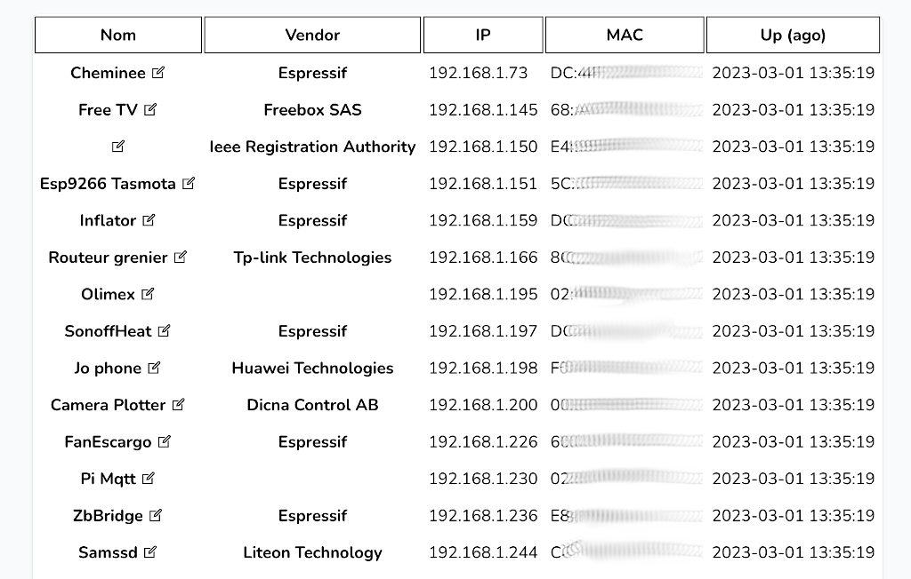

<p align="center"><a href="documentation/HostsTable.png" target="_blank"></a></p>


<a href="https://packagist.org/packages/laravel/framework"></a>
</p>

## About NetMap

<p>NetMap simply parse [nmap](https://nmap.org/) XML ouptput and save hosts on (local) network in a MySQL/MariaDB table.</p>

<p>A name can be associated with host (interface) retrieved by MAC address.</p>

<p>&nbsp;</p>

## Console/Cli parser

It uses Laravel, main simple code is done in:

[app/Console/Commands/NmapParser.php](app/Console/Commands/NmapParser.php)

<p>&nbsp;</p>

## Crontab example to scan network every 5 minutes

Script to scan, save XML and import results with parser [crontask.sh](crontask.sh)

```
*/5 * * * * ~/websites/NetNmap/crontask.sh >/dev/null 2>&1
```

## License

The Laravel framework is open-sourced software licensed under the [MIT license](https://opensource.org/licenses/MIT).

NetMap is open-sourced software licensed under the [MIT license](https://opensource.org/licenses/MIT).
